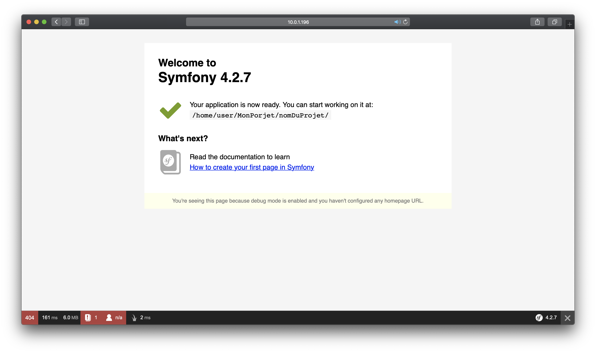

### Ce guide vous aidera à créer un projet Symfony.
Nous verrons comment :
* télécharger php 7.3
* télécharger Composer 1.8.5
* créer un projet Symfony

### Symfony, qu'es ce que c'est ?

Symfony est un framework libre écrit en PHP. Il fournit des fonctionnalités modulables et adaptables qui permettent de faciliter et d’accélérer le développement d'un site web.
Il a été développé par une agence web française "SensioLabs". À force de toujours recréer les mêmes fonctionnalités de gestion d'utilisateurs, gestion ORM, etc., elle a développé ce framework pour ses propres besoins. Comme ces problématiques étaient souvent les mêmes pour d'autres développeurs, le code a été par la suite partagé avec la communauté des développeurs PHP. La première version de Symfony a été réalisé le 18 octobre 2005.
Le 5 septembre 2017, Symfony passe la barre du milliard de téléchargements. 

### Comment installer Symfony ?

D'abord nous devons installer php, minimum php 7.1, dans ce tuto je vous montrerais comment installer php 7.3, pour cela il vous suffit de faire cela :
```bash 
apt update
apt install apt-transport-https lsb-release ca-certificates
wget -O /etc/apt/trusted.gpg.d/php.gpg https://packages.sury.org/php/apt.gpg
sh -c 'echo "deb https://packages.sury.org/php/ $(lsb_release -sc) main" > /etc/apt/sources.list.d/php.list'
apt update
apt install -y nginx php7.3 php7.3-common php7.3-cli php7.3-fpm php7.3-mysql php7.3-xml php7.3-curl php7.3-mbstring php7.3-zip
apt upgrade
```
Une fois l'installation terminé vous pouvez vérifier la version de votre php en écrivant ceci :
```bash
php -v
```

Maintenant pour faire fonctionner Symfony il nous faut Composer, vous pouvez l'installer comme cela :
```bash
php -r "eval('?>'.file_get_contents('http://getcomposer.org/installer'));"
```

Vous devriez avoir ce résultat :
```bash
All settings correct for using Composer
Downloading...

Composer (version 1.8.5) successfully installed to: C:\wamp\www\admin\composer.phar
Use it: php composer.phar
```

Une fois cela fait nous pouvons déplacer le dossier "composer.phar" :
```bash
mv composer.phar /usr/bin/composer
```
Maintenant nous pouvons créer un projet :<br>
**Cette commande va créer l'architecture de votre site je vous conseille donc de la lancer dans un dossier**
```bash
composer create-project Symfony/website-skeleton nomDuProjet
```
Une fois cette commande lancer vous devrez attendre que le projet soit créé par composer, cela peut prendre du temps...

Pour finir il vous suffit de démarrer le serveur, pour cela placer vous dans le projet et lancer cette commande :

```bash
php bin/console server:start 0.0.0.0:8000
```

Puis rendez-vous sur "ip:8000"



Installation réaliser sur Debian 9.8 <br>
Sources pour réaliser ce tuto : www.jesusamieiro.com — www.openclassrooms.com
