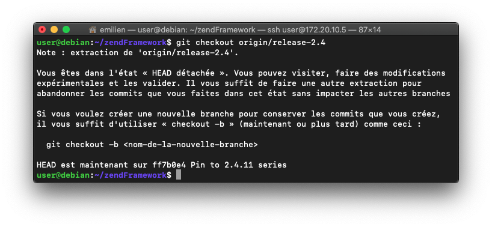
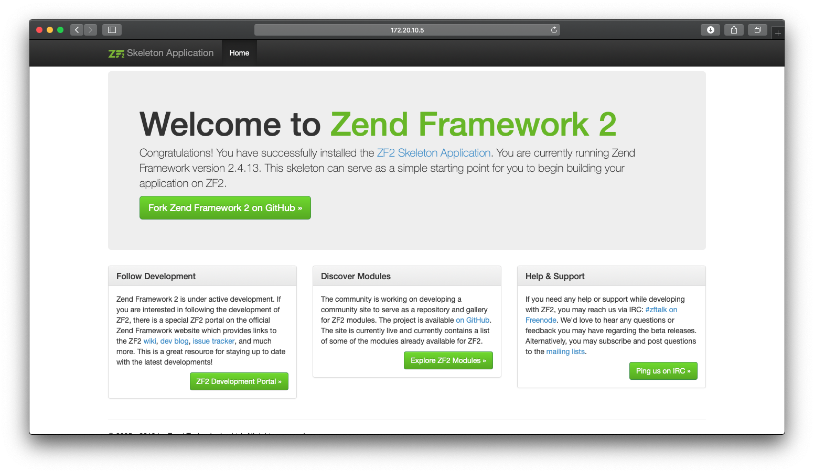

### Ce quide vous aidera à créer un projet Zend Framework en `version 2.4.13` sur Debian

Vous aurrez besoin de :
* PHP 5.3 ou suppérieur.
* Composer
* Mariabd, MySQL, ...
* git

### Installer Zend Framework 2

#_ces commandes sont a réaliser en user mode !_

Nous allons d'abord récupperer le squelette de l'application sur git.<br>
_Attention a bien changer le nom de votre dossier !_
```bash
git clone https://github.com/zendframework/ZendSkeletonApplication.git nomDeVotreProjet
```

Puis mettez vous dans votre dossier.
```bash
cd nomDeVotreProjet
```
Ensuite nous allons selectionner la branche 2.4.
```bash
git checkout origin/release-2.4
```
vous devriez voir ça :



Pour finir il vous suffi d'installer composer.
```bash
composer install
```
Afin d'acceder au site entrer cette commande avec votre adresse ip.
```bash
php -S 0.0.0.0:8080 -t public
```

